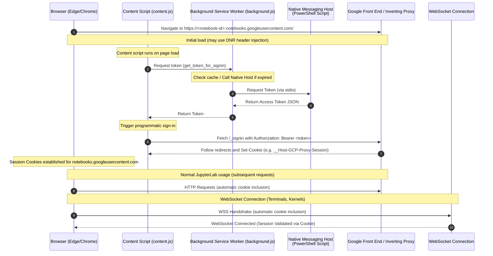

# GCP Authentication Extension for Vertex AI Workbench in VDI

This repository contains a secure, proxy-less solution to enable VDI users on dedicated VMs to access private Google Cloud Vertex AI Workbench user-managed notebooks using their own **Google User Identity**.

It uses a **Browser Extension** and **Chrome/Edge Native Messaging** helper, eliminating the need to bind to local ports or manage complex network routing.

---

## Overview

### The Problem
In secure VDI environments, Vertex AI Workbench notebooks are often deployed with **Single User Authorization** in private networks (no public IP). Accessing these notebooks from VDI sessions presents authentication challenges because interactive browser-based login loops are difficult to support due to network isolation.

### The Solution
Instead of routing all network traffic through a local port (like a reverse proxy), this solution intercepts requests *inside* the browser using an extension and injects the `Authorization` header. 

The extension retrieves short-lived OAuth access tokens dynamically from the local VDI environment (via `gcloud`) using **Chrome/Edge Native Messaging**.

### Key Benefits
*   **Zero Port Exposure**: Unlike a proxy binding to `127.0.0.1`, this solution does not open any TCP/UDP ports. Other users on the same multi-session VDI host cannot sniff or connect to the token exchange.
*   **Browser-Managed Lifecycle**: The native messaging host is launched by the browser on demand and terminated automatically when the browser closes.
*   **High Performance**: Uses browser cookies (`DATALAB_TUNNEL_TOKEN`) for normal session traffic, invoking the native messaging host only for the initial bootstrap and token refreshes.

---

## How It Works

### High-Level Architecture

The browser extension intercepts the initial navigation to the notebook, requests a token from the native host via standard input/output (`stdio`), injects the bearer token, and establishes the session.



### Session Lifecycle & Cookie Integration

To avoid resource overhead, the extension does not invoke the native host for every request. It relies on standard browser cookie handling once the session is established.

```mermaid
stateDiagram-v2
    [*] --> Unauthenticated : Open Notebook URL
    Unauthenticated --> FetchingToken : Extension Intercepts
    FetchingToken --> InjectingHeader : Call Native Messaging Host
    InjectingHeader --> SessionEstablished : Send Request + Bearer Token
    Note over SessionEstablished: Server responds with Set-Cookie
    SessionEstablished --> UsingCookies : Subsequent Requests (Lab Usage)
    Note over UsingCookies: Browser automatically sends cookie.<br/>Native Host is idle/terminated.
    UsingCookies --> SessionExpired : Cookie Expires (~1 Hour)
    SessionExpired --> FetchingToken : Extension Intercepts 401/Redirect
```

---

## Setup & Deployment Guide

This is a simplified, user-local deployment workflow for existing (mature) Windows VDI VMs.

### Prerequisites
*   You have downloaded the `extension-installer.zip` package to your VM.
*   Google Cloud SDK (gcloud) is installed on the VM.
*   Microsoft Edge (or Google Chrome) is installed.

### Step 1: Authenticate with GCloud
Open a Command Prompt or PowerShell and login:
```powershell
gcloud auth login --no-launch-browser
```
Follow the instructions to authenticate using your Google identity (e.g., `user@example.com`) and cache the credentials locally.

### Step 2: Extract and Run the Installer (Admin Required)
1.  Extract `extension-installer.zip` (e.g., to `C:\Users\<username>\extension-installer`).
2.  Open **PowerShell as Administrator** and navigate to the extracted folder:
    ```powershell
    cd C:\Users\<username>\extension-installer\extension-installer
    ```
3.  Run the installer:
    ```powershell
    Set-ExecutionPolicy -Scope Process -ExecutionPolicy Bypass
    .\install.ps1
    ```

This script will:
*   Copy the native host scripts to `C:\Program Files\Google\AuthenticationExtension\`.
*   Copy the browser extension to `C:\Program Files\Google\AuthenticationExtension\extension\`.
*   Register the native host in the Windows Registry under `HKEY_LOCAL_MACHINE` (for both Chrome and Edge, including 32-bit redirection paths).

### Step 3: Load the Extension in the Browser
1.  Open **Microsoft Edge** (or Chrome).
2.  Navigate to **`edge://extensions/`** (or `chrome://extensions/`).
3.  Toggle **ON** **Developer mode** (usually in the bottom-left or top-right).
4.  Click **Load unpacked**.
5.  Select the folder:
    `C:\Program Files\Google\AuthenticationExtension\extension`
6.  Verify that the extension **"Workbench Token Helper Extension"** appears with ID: `ibjloicofmomodambndmdpincachgddd`.

### Step 4: Access your Notebook
Navigate directly to your Vertex AI Workbench notebook URL (e.g., `https://<notebook-id>-dot-us-central1.notebooks.googleusercontent.com`). The extension will automatically authenticate your session.

---

## Developer Guide

### Extension ID Stability
Chrome native messaging requires matching the extension's ID in the host's `allowed_origins` list. To ensure the unpacked extension always has the same ID (`ibjloicofmomodambndmdpincachgddd`), we use a static public key in `manifest.json`.

If you need to regenerate keys or calculate a new ID:
1.  Run the helper script:
    ```bash
    python3 id-creator/calculate_extension_id.py
    ```
    This generates `key.pem`, calculates the ID, and automatically injects the public key into `src/extension/manifest.json` and updates the host manifest.

### Packaging for Distribution
To package the installer for users, run the packager script (on development machine):
```bash
# Example packaging command (Linux/Mac)
mkdir -p /tmp/extension-installer/src
cp install.ps1 /tmp/extension-installer/
cp -r src/extension /tmp/extension-installer/src/
cp -r src/native_host /tmp/extension-installer/src/
cd /tmp
zip -r extension-installer.zip extension-installer
```
